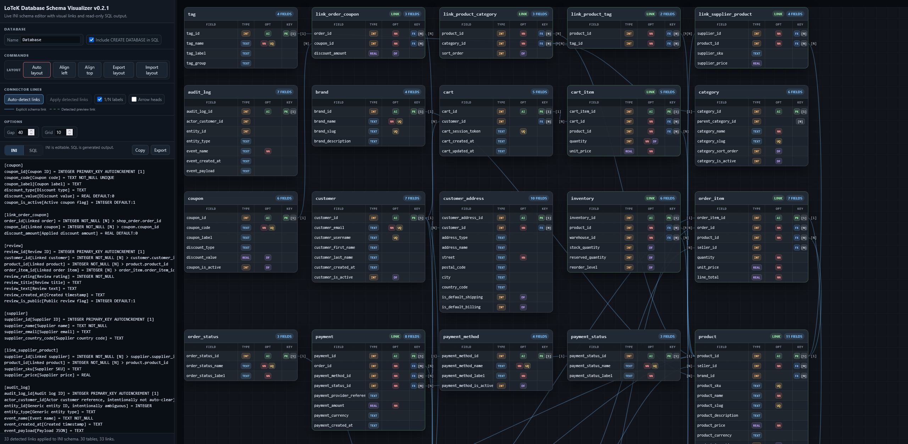

# LoTeK Database Schema Visualizer


Lightweight browser-based database schema visualizer with INI-style schema editing, live diagram rendering, SQL export, auto-detected relationships, and layout import/export.



## Overview

LoTeK Database Schema Visualizer is a local browser-based tool for planning, reviewing, and visualizing database schemas.

It uses a compact INI-style schema format, renders draggable table boxes, shows explicit and auto-detected relationships, and generates read-only SQL output.

The tool is useful when you want to quickly design or inspect a database structure without opening a full database IDE.

## Description

The editor uses a human-readable schema format:

```ini
[table_name]
field_name[label text] = SQL_TYPE SQL_OPTION [1|N] > target_table.target_field
```

The visualizer reads this schema live and displays tables, fields, datatypes, options, primary keys, foreign keys, and relationship lines.

It does not require a server, database connection, build step, package manager, or installation.

## Features

- INI-style schema editing
- live visual table rendering
- draggable table boxes
- explicit relationship lines
- safe primary-key based relationship detection
- optional apply of detected links into the INI schema
- read-only SQL output
- optional `CREATE DATABASE` SQL header
- database-name based export filenames
- layout export/import as JSON
- manual table alignment
- dynamic workspace size
- no server dependency
- no database connection required

## Installation

### Requirements

- modern browser
- JavaScript enabled
- local file access in the browser

No external libraries are required.

### Local Use

Open:

```text
LoTeK-Database-Schema-Visualizer.html
```

depending on the chosen release file name.

## Usage

1. Open the HTML file in a browser.
2. Enter or paste an INI-style database schema.
3. Review the generated visual diagram.
4. Use `Auto-detect links` to preview safe primary-key based relationships.
5. Use `Apply detected links` to write detected links into the schema.
6. Use the SQL tab to copy or export generated SQL.
7. Use layout export/import to continue working on large schemas later.

## Schema Format

Basic format:

```ini
[table_name]
field_name[label text] = SQL_TYPE SQL_OPTION [1|N] > target_table.target_field
```

Example:

```ini
[product]
product_id[Product ID] = INTEGER PRIMARY_KEY AUTOINCREMENT [1]
product_name[Product name] = TEXT NOT_NULL

[order_item]
order_item_id[Order item ID] = INTEGER PRIMARY_KEY AUTOINCREMENT [1]
product_id[Linked product] = INTEGER NOT_NULL [N] > product.product_id
quantity[Quantity] = INTEGER NOT_NULL DEFAULT:1
```

### Options

Supported schema option tokens:

```text
PRIMARY_KEY
AUTOINCREMENT
NOT_NULL
UNIQUE
DEFAULT:<value>
```

Cardinality markers:

```text
[1]
[N]
```

Relationship target syntax:

```text
> table.field
```

Multiple target references can be written after `>` if needed, but SQL output can only translate simple single-target foreign keys into direct SQL foreign-key lines.

## Supported Tokens

The visualizer recognizes the following basic datatype tokens for display and color grouping:

```text
INTEGER
TEXT
REAL
BLOB
```

Other SQL or MySQL datatype tokens can also be used, for example:

```text
INT
BIGINT
VARCHAR(255)
CHAR(64)
DECIMAL(10,2)
FLOAT
DOUBLE
DATE
DATETIME
TIMESTAMP
TIME
YEAR
TINYBLOB
MEDIUMBLOB
LONGBLOB
TINYTEXT
MEDIUMTEXT
LONGTEXT
ENUM(...)
SET(...)
JSON
BOOLEAN
```

These tokens are accepted and preserved in the generated SQL output, but they may not receive special color highlighting in the visual table view.

The tool does not perform full SQL dialect validation. It does not check whether a datatype, option, size, enum definition, or SQL expression is valid for SQLite, MySQL, MariaDB, PostgreSQL, or any other database system.

Users are responsible for writing valid schema definitions and for checking the generated SQL before using it in a real database.

## Database Section

The `Database` section contains:

```text
Name
Include CREATE DATABASE in SQL
```

The database name is used for export filenames.

Examples:

```text
ShopDemo.ini
ShopDemo.sql
ShopDemo.json
```

`Export layout` saves the database name and the `Include CREATE DATABASE in SQL` setting in the JSON layout package. `Import layout` restores both values.

### CREATE DATABASE SQL Option

`Include CREATE DATABASE in SQL` is optional and disabled by default.

When enabled, the generated SQL output starts with:

```sql
CREATE DATABASE ShopDemo;
```

This is mainly useful for SQL engines such as MySQL or MariaDB. SQLite normally does not use `CREATE DATABASE`; the database is represented by the database file itself.

The option only affects the SQL tab and SQL export. It does not change the INI schema text.

## Connector Lines

Line types:

```text
Blue solid line:
  explicit schema link from the INI code

Green dashed line:
  auto-detected preview link, not yet written into the INI code
```

Arrow heads are only visual. They do not change schema data or SQL output.

`1/N labels` are visual schema metadata. They are not SQL constraints.

### Auto-detect Links

`Auto-detect links` searches for safe relationship candidates.

Detection rule:

```text
A field is auto-linked only if another table has a PRIMARY_KEY field with the exact same field name.
```

Example:

```ini
[product]
product_id[Product ID] = INTEGER PRIMARY_KEY AUTOINCREMENT [1]

[order_item]
product_id[Linked product] = INTEGER NOT_NULL [N]
```

After `Auto-detect links`, the visualizer draws a green dashed line:

```text
order_item.product_id -> product.product_id
```

The INI schema is not changed at this stage.

### Apply Detected Links

`Apply detected links` writes the currently detected green dashed links into the INI schema.

Before:

```ini
product_id[Linked product] = INTEGER NOT_NULL [N]
```

After:

```ini
product_id[Linked product] = INTEGER NOT_NULL [N] > product.product_id
```

After applying, the line becomes a blue solid line because it is now explicit schema data.

### Auto-detect Limits

Auto-detect deliberately does not guess relationships where the target is not a primary key.

These relationships must be written manually with `> table.field`.

## Layout Tools

Layout commands:

- `Auto layout`
- `Align left`
- `Align top`
- `Export layout`
- `Import layout`

`Ctrl+Click` or `Cmd+Click` selects multiple tables. Selected tables receive a blue border.

`Align left` and `Align top` require at least two selected tables.

## Options

```text
Gap:
  spacing used by Auto layout

Grid:
  snap grid used only when manually dragging tables
```

Defaults:

```text
Gap = 30
Grid = 10
```

## Layout JSON Export

`Export layout` writes a JSON package containing:

```text
- app/version metadata
- database name
- CREATE DATABASE setting
- current INI schema text
- visual table positions
- options
```

This allows large schemas to be arranged visually and continued later.

## Dynamic Workspace Size

The visual workspace is sized dynamically.

The visible stage is used as the minimum size. After rendering, auto layout, layout import, window resize, and table dragging, the tool measures the real table positions and expands the workspace to the largest table extents plus 400 px of extra space to the right and bottom.

This avoids a huge fixed canvas while still keeping enough free room for manual table placement.

## Limitations

This release is not a full visual database editor.

Not included:

- visual table creation
- visual field editing
- drag-based relationship creation
- line deletion by mouse
- full SQL dialect validation
- database reverse engineering from live database connections

These features may be considered later if the repository receives clear external interest.

## Repository Structure

<details>
<summary>Show repository structure</summary>

```text
LoTeK_DataBase_Schema_Visualizer
├── assets
│     └── img
│           └── Screenshot_LoTeK_Database_Schema_Visualizer_v0.2.1.png    # README screenshot preview
├── css
│     └── lotek-database-schema-visualizer.css                            # Visual styling for the app
├── js
│     └── lotek-database-schema-visualizer.js                             # Parser, renderer, SQL generator, layout logic
├── CHANGELOG.md                                                          # Version history
├── example-schema.ini                                                    # Example schema for testing and demo use
├── LICENSE                                                               # MIT license text
├── LoTeK-DataBase-Schema-Visualizer.html                                 # Main local browser app
└── README.md                                                             # Project overview and usage notes
```

</details>

## Development Note

This project was developed with the assistance of AI tools for research, coding support, and documentation.

## License

MIT License.